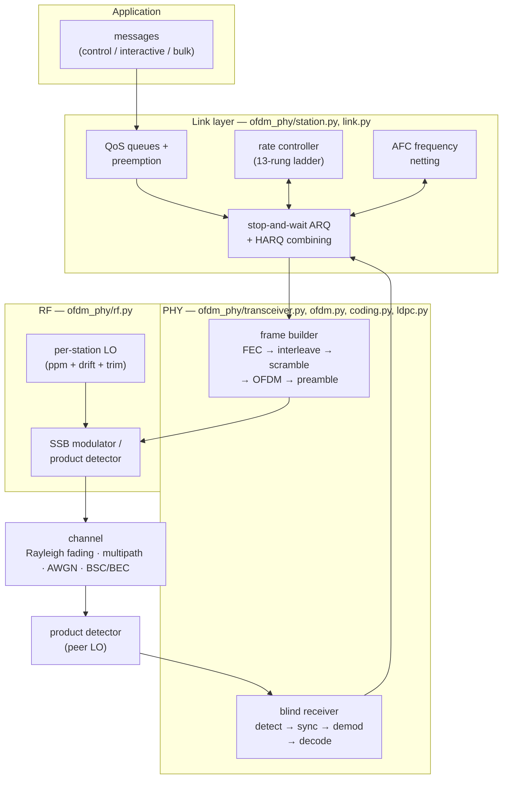

# Documentation

An audio-band OFDM data modem for SSB transceivers: a faithful reproduction of the
[Habr article](https://habr.com/ru/articles/1070804/) PHY layer, extended into a
complete adaptive communication system with a link layer, an RF model, and a
fixed-point RTL reference.

| Document | Contents |
|---|---|
| [architecture.md](architecture.md) | System layers, module map, design principles |
| [phy.md](phy.md) | PHY: frame structure, TX/RX chains, synchronization, modes |
| [link.md](link.md) | Link layer: rate ladder, ARQ/HARQ, QoS, simplex access, AFC |
| [rf.md](rf.md) | RF layer: SSB chain, LO model, channel impairments |
| [drivers.md](drivers.md) | Channel drivers: virtual channel, SDR, USB host transports |
| [console.md](console.md) | `ofdm_console` and `board_console.py`: modes, commands, behaviors |
| [usb-protocol.md](usb-protocol.md) | USB transport: enumeration, framing, frame types, payload layouts |
| [modem-protocol.md](modem-protocol.md) | RFC-style specification of the host protocol: framing, every command/event, structure offsets, registries, compatibility rules |
| [fixed-point.md](fixed-point.md) | Integer RTL reference model |
| [c-port-plan.md](c-port-plan.md) | Plan: pure-C port of the fixed model + DSP/MCU feasibility gates |
| [performance.md](performance.md) | All measured results in one place |
| [experiments.md](experiments.md) | Validation and experiment scripts guide |

## The system at a glance

Three properties shape everything:

1. **Frames are self-describing** — the Zadoff-Chu preamble root identifies the
   link mode, the header carries modulation/FEC — so a blind receiver decodes any
   frame and protocol negotiation can never deadlock.
2. **Every receiver measurement is fed back** — SNR reports drive the rate
   ladder, CFO measurements drive frequency netting, decode outcomes drive
   learned sensitivities and HARQ.
3. **Two parallel reference implementations** — the float model (with an
   article-faithful default mode) and an integer fixed-point twin for RTL work —
   are cross-validated continuously.
