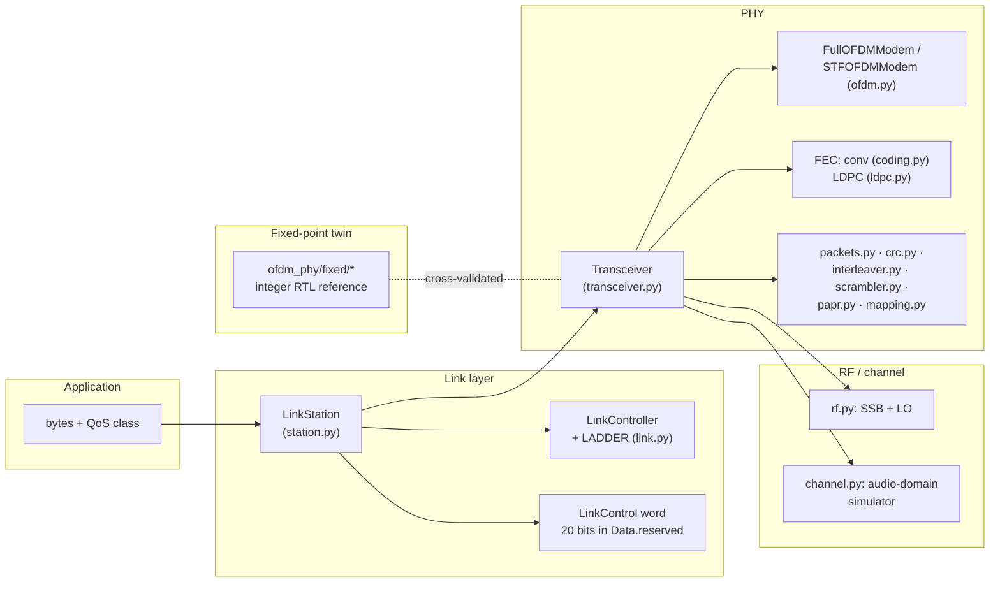
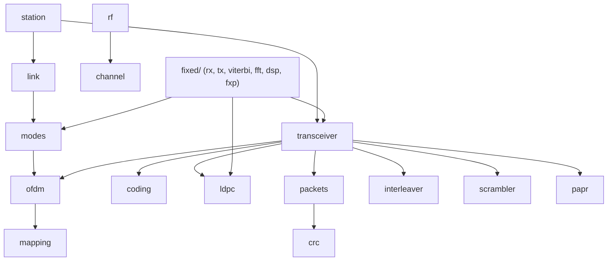
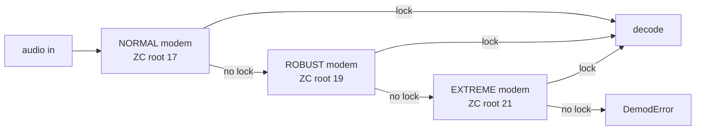
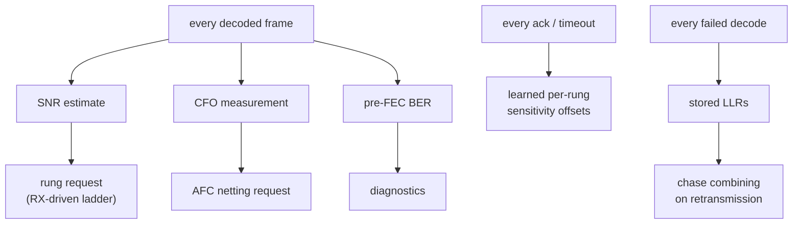

# Architecture

## Layers and responsibilities



## Module dependency map



`channel.py` and `rf.py` are simulation-side; a real deployment replaces them
with a soundcard and a transceiver. `fixed/` mirrors the PHY in integer
arithmetic and reuses the (already integer-exact) bit pipeline.

## Design principles

### Self-describing frames — no mode negotiation

The receiver needs the tile factor to demodulate even the header, so the mode
cannot be signalled *inside* the frame. Instead each link mode owns a distinct
Zadoff-Chu preamble root (17/19/21): only the transmitted mode's matched filter
locks, and `demod_frame_auto` simply tries the modes in turn.



Consequence: a mode switch can never deadlock the link. The worst case is a
lost frame, the transmitter's loss fallback, and re-convergence at the EXTREME
floor — which works whenever anything works.

### Faithful defaults, opt-in improvements

The plain `Transceiver` reproduces the article's behaviour (convolutional FEC,
raw LLRs). System-level improvements are opt-in and live at the link layer:

| Improvement | Where enabled |
|---|---|
| LLR recalibration (`llr_recal="auto"`) | `LinkStation` |
| LDPC data coding (`fec="ldpc"`, header ver=2) | caller's choice |
| HARQ chase combining | `LinkStation` |
| AFC netting | `LinkStation` + `freq_trim_cb` |

This keeps the article-reproduction experiments valid forever while the system
evolves above them.

### Everything measured feeds back



## Source layout

```
ofdm_phy/
├── ofdm.py         OFDM modem core (symbols, pilots, preambles, sync, demod)
├── transceiver.py  frame TX/RX chains, LLR calibration, HARQ, mode auto-detect
├── coding.py       K=7 conv code + puncturing + vectorized soft Viterbi
├── ldpc.py         rate-1/3 IRA LDPC + min-sum (float and integer kernels)
├── mapping.py      BPSK / QPSK / 16-QAM Gray mappers
├── packets.py      Header / Beacon / Data + CRC-8/16
├── interleaver.py, scrambler.py, papr.py, crc.py
├── modes.py        NORMAL / ROBUST / EXTREME presets, select_mode policy
├── link.py         rate ladder, LinkControl word, LinkController
├── station.py      LinkStation: QoS, ARQ/HARQ, simplex access, AFC
├── rf.py           SSB modulator/demodulator, StationRF LO model
├── channel.py      audio-domain channel simulator (+ Rayleigh fading)
└── fixed/          integer twin: fxp, fft, dsp, viterbi, tx, rx
experiments/        validation suites and demos (see experiments.md)
results/            generated figures, WAVs, JSON sweeps
cport/              pure-C port of the fixed model: src/ (DSP, station,
                    USB protocol/modem), usb/ (TinyUSB firmware, the
                    flash-resident radio), target/ (STM32H743 startup +
                    linker), bench/ (host harnesses: burst_repro,
                    bc_repro, bc_fade, csense_test), tests/ (golden-
                    vector suites)
demoapp/            two-station console demo: ofdm_console (socket and
                    USB modes), driver.py / sdr_driver.py channel
                    drivers, board_console.py (see drivers.md,
                    console.md)
host/               Python host library for the USB modem
                    (ofdm_modem.py) + udev rule
tools/esp32-probe/  the ESP32 JTAG bitbang probe for the two-board stand
```
