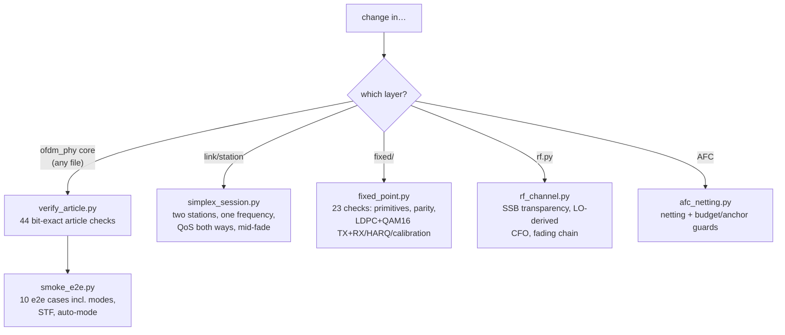
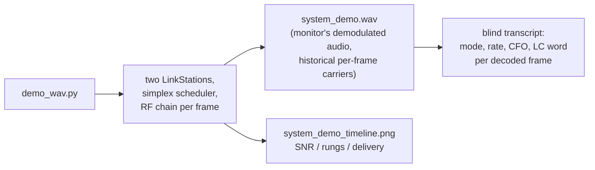

# Experiments and validation guide

All scripts run as `./venv/bin/python experiments/<name>.py` and are
self-verifying (PASS/FAIL exit codes where applicable).

## Regression tier — run after touching the corresponding layer

## Full catalogue

| Script | Purpose | Typical runtime |
|---|---|---|
| `verify_article.py` | 44 bit-exact checks against the article's worked examples | seconds |
| `smoke_e2e.py` | 10 end-to-end TX→channel→RX cases | ~1 min |
| `shannon_limit.py` | article Tables 1–2 (capacity, efficiency) | seconds |
| `ber_per_simulation.py [--modem stf] [--trials N]` | article Fig. 23/24: 8 mod/rate configs × 12 SNRs, multiprocess | ~2 min |
| `adaptive_modes.py` | PER waterfalls for NORMAL/ROBUST/EXTREME | ~3 min |
| `ladder_sweep.py` | re-measure all 13 rung sensitivities (recal RX) | ~3 min |
| `stf_vs_newman.py` | preamble variant A/B over ±300 Hz CFO | ~2 min |
| `compare_stf_newman.py` | overlay + 2σ statistical comparison of the two sweeps | seconds |
| `llr_calibration.py` | LLR reliability measurement, temperature fit, LDPC A/B | ~3 min |
| `ldpc` (inside `llr_calibration.py` / ad-hoc) | AWGN BLER conv vs LDPC | — |
| `fixed_point.py [--trials N]` | fixed-point validation (23 checks) | ~2 min |
| `fixed_qam16_sweep.py [--trials N]` | QAM16 rung sensitivities, fixed vs float RX A/B | ~2 min |
| `coarse_search_ab.py [--trials N]` | gated two-stage freq search vs full grid: PER waterfalls, float+fixed, parity-asserted | ~20 min |
| `stream_mode.py [--trials N] [--blocks N] [--resync N]` | streamed bursts vs per-frame preambles: delivery + goodput, fitted dB cost | ~5 min |
| `cfo_unwrap.py [--trials N] [--replot]` | what the coarse-CFO unwrap is worth: timing outliers and frame delivery swept across one detection bin | ~6 min |
| `broadcast_demo.py [--trials N]` | non-ARQ delivery vs SNR for speech and telemetry rungs, plus a late-joining receiver | ~6 min |
| `rf_channel.py` | RF layer validation (6 checks) | ~1 min |
| `afc_netting.py` | AFC convergence + trim-budget/anchor scenarios | ~3 min |
| `link_adaptation.py` | controller-level two-station sim over a fading timeline | ~2 min |
| `simplex_session.py` | whole-system simplex test, bit-exact delivery assert | ~5 min |
| `demo_wav.py [--snr X] [--phy fixed]` | records the system demo WAV over the RF chain + blind transcript + timeline plot; `--phy fixed` runs stations and monitor on the full fixed-point pipeline | ~3–8 min |
| `make_wav.py --mode M` | per-mode test WAVs (clean + at sensitivity limit), decode-verified | ~1 min |
| `figures.py` | ZC ACF, TX spectrogram, equalization constellations | ~1 min |
| `ota_demo.py` | article-style decoder log over adaptive modes | ~2 min |

## The demo pipeline

`--snr -2` (default): QPSK-era session with AFC netting visible in the CFO
column. `--snr 5`: 16-QAM top-rung session. `--phy fixed` (tags outputs
`_fixed`): the same sessions on the integer pipeline end to end.

## Conventions

- Fixed seeds for A/B comparisons (same channel realizations per arm).
- PER points: ≥40 trials for probes, 48–120 for published numbers.
- Any new sensitivity claim gets a JSON dump in `results/` next to the plot.
