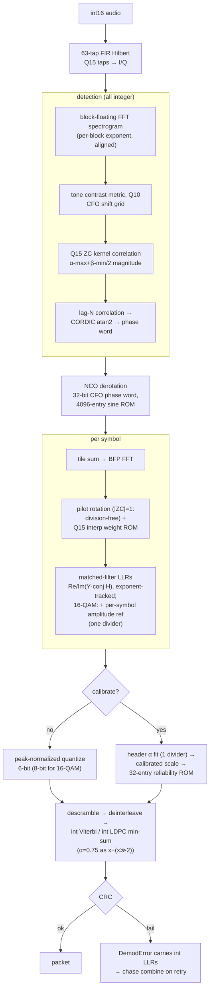
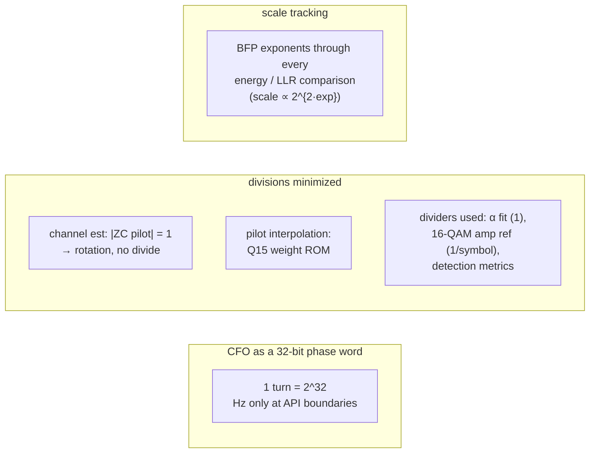

# Fixed-point RTL reference model (`ofdm_phy/fixed/`)

An integer-only twin of the modem, structured the way an FPGA/ASIC datapath
would be. It is the golden reference an RTL implementation verifies against;
`experiments/fixed_point.py` (23 checks) cross-validates it against the
float model continuously.

## Receiver datapath

## Primitive blocks and their measured quality

| Block | Structure | Quality |
|---|---|---|
| FFT | radix-2 DIT, Q15 twiddle ROM, per-stage >>1 (built-in 1/N), BFP wrapper | 59 dB SQNR |
| Hilbert | 63-tap type-III FIR, Q15 | 61 dB SQNR |
| NCO | 32-bit phase accumulator, 4096 × Q15 sine ROM | −67 dBc |
| CORDIC | 16-iteration vectoring, angle in phase-word units | <0.001 rad |
| Viterbi | 6-bit LLRs (8-bit for 16-QAM data), ±1 expected symbols → adds only, int32 metrics | exact |
| LDPC | integer normalized min-sum, α = x−(x>>2) | matches float min-sum |

## RTL-oriented conventions

## What the model covers

The full frame family, on both sides: conv + LDPC FEC (TX via
`build_frame(fec="ldpc")` → ver=2), BPSK/QPSK/16-QAM (Q15 Gray
constellations, 16-QAM levels {±1,±3}/√10), all three link modes, HARQ
chase combining, and the optional calibrated-LLR mode.

**Integer SNR estimator** (`FixedReceiver.last_stats.snr_db`): data-aided,
over every symbol with known bits — the re-encoded header always, plus the
decoded data block for MU≤2. Per-column moments remove the multipath |H|²
spread; rows (symbols) are **gain-weighted** by their mean |LLR| so a tiled
frame spanning several fade cycles measures the signal-energy-weighted
average SNR (the float estimator's flavor, which the rate ladder was tuned
against) instead of counting fading swings as noise — equal-weight pooling
was measured 5–15 dB pessimistic on faded EXTREME frames. Pure
accumulators + a bit-length/LUT log2; no dividers. One global calibration
constant (−7.2 dB); accuracy ≤1.5 dB across all modes/modulations,
−17…+8 dB.

**Gated two-stage frequency search** (first symbol): a quarter-length
coarse pass (tiles/4 accumulation, 4× grid stride) ranks hypotheses; if
the top1/median contrast clears 2.25× (Q4 gate 36), only the top-3 ±5
fine windows run at full precision (~5.5× fewer derotated samples at
EXTREME); below the gate — measured to be where the coarse argmax becomes
unreliable (contrast ≤2.2× at −17/−18 dB vs ≥2.7× at −12) — the
exhaustive grid runs unchanged, so the sensitivity edge is lossless by
construction. The same gated structure also ships in the float
demodulator's per-symbol search (`TiledOFDMModem.coarse_freq_search`),
where it pays on every symbol — the float chain has no slew-limited
tracker. A/B verified across the full EXTREME/ROBUST waterfalls, both
models: every gated PER point identical to the exhaustive grid
(`experiments/coarse_search_ab.py`, `results/coarse_search_ab.png`).

**Link-layer integration** (`FixedPHY` in `fixed/phy.py`): a
float-`Transceiver`-compatible adapter (fixed TX + per-mode fixed RXs with
blind mode auto-detection by preamble root) that plugs into
`LinkStation(phy=...)` — the whole adaptive link runs on the fixed
pipeline. `experiments/demo_wav.py --phy fixed` records the system demo
this way.

**QAM16 sensitivity** (`experiments/fixed_qam16_sweep.py`, 48 pkts/point,
fixed TX → same samples into both RX): fixed +1.5/+2.9/+5.3 dB vs float
+0.8/+2.6/+4.5 for rate 1/2 / 2/3 / 3/4 — within 0.3–0.8 dB everywhere.
This required a **per-modulation quantizer**: 16-QAM max-log LLRs span a
much wider dynamic range (inner/outer bits × per-carrier gain), and the
6-bit peak-normalized quantization cost ~2 dB on the puncture-weak 2/3 and
3/4 rates. Data blocks with MU=4 now use `_quantize8` (peak-normalized,
±127); MU≤2 keeps the 6-bit path, whose compression is what *helps* at the
BPSK edge. Peak vs mean normalization measured equivalent at 8 bits — the
win is the resolution, so the RTL cost is just two extra LLR bits on the
QAM16 data path. The calibrated path remains gated to MU≤2.

**Measured surprise:** the default 6-bit peak-normalized quantization already
acts as a compressive recalibration, and the slew-limited frequency tracker
beats the float polyfit at the edge — the fixed RX **matches or beats the
recalibrated float chain at −9/−10 dB** (22 vs 20 and 11 vs 5 of 30).
`calibrate=True` therefore buys a *stable cross-frame LLR scale* (what makes
HARQ combining legitimate), not extra PER.

## Known deltas vs the float model (intentional)

- NORMAL-mode tone detection uses a 256-point FFT (float: 128) so the coarse
  CFO grid is fine enough for an unambiguous lag-N residual.
- The demodulator uses the frequency-search tracker for **all** tile factors
  (the float polyfit is not RTL-friendly — and measurably weaker anyway).

## Debug lore (bugs that cost time — don't repeat)

- The ZC metric's Q-scaling must account for **both** /2¹⁵ factors the Q15
  kernel introduces (missing one made a perfect correlation score 0.006).
- scipy's `remez(..., type="hilbert")` returns taps giving −sin for cos
  input: negate for a positive-frequency analytic signal.
- Compare BFP energies only after shifting by 2·Δexp.
