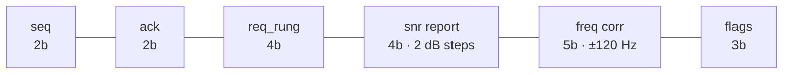
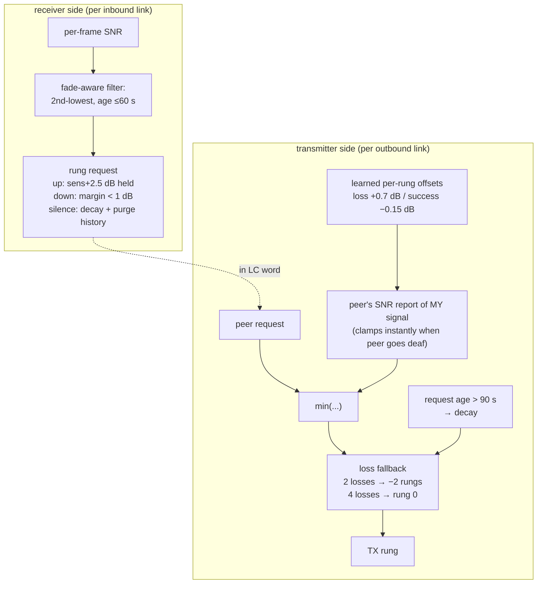
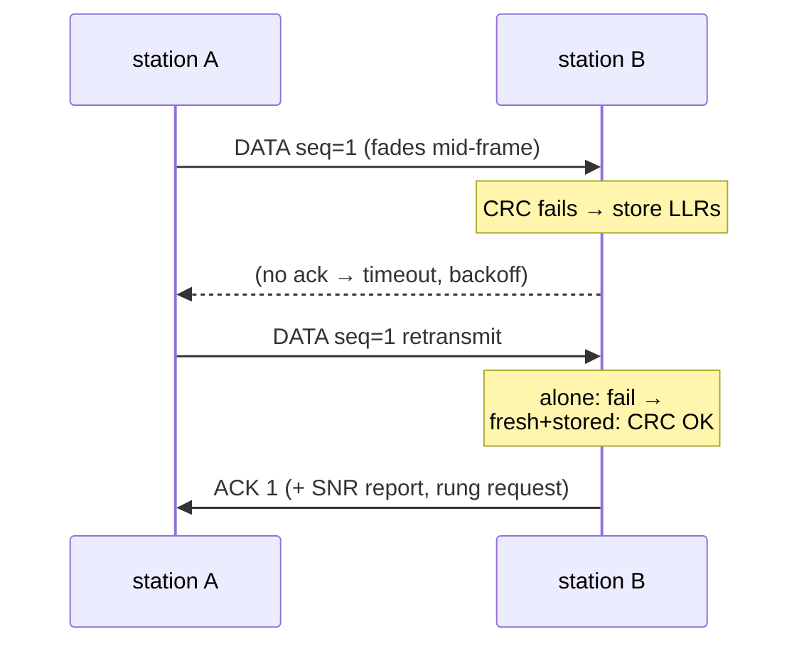
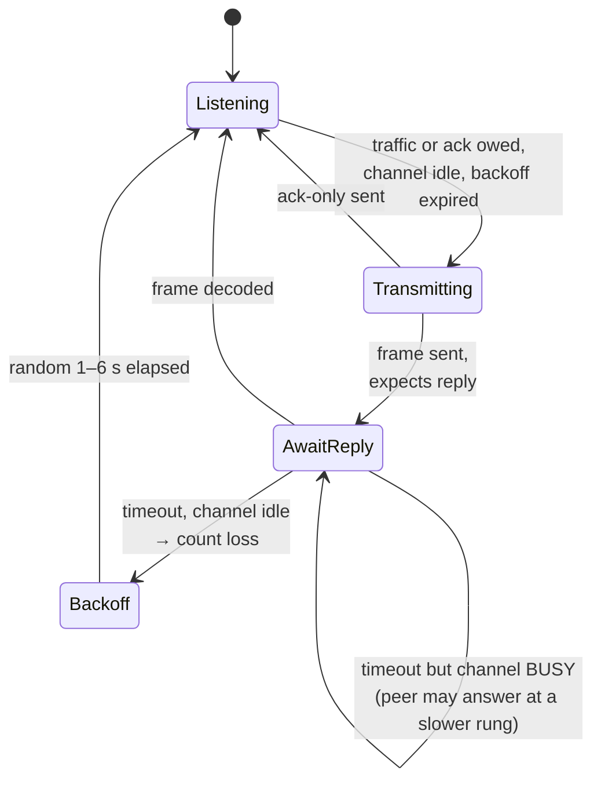
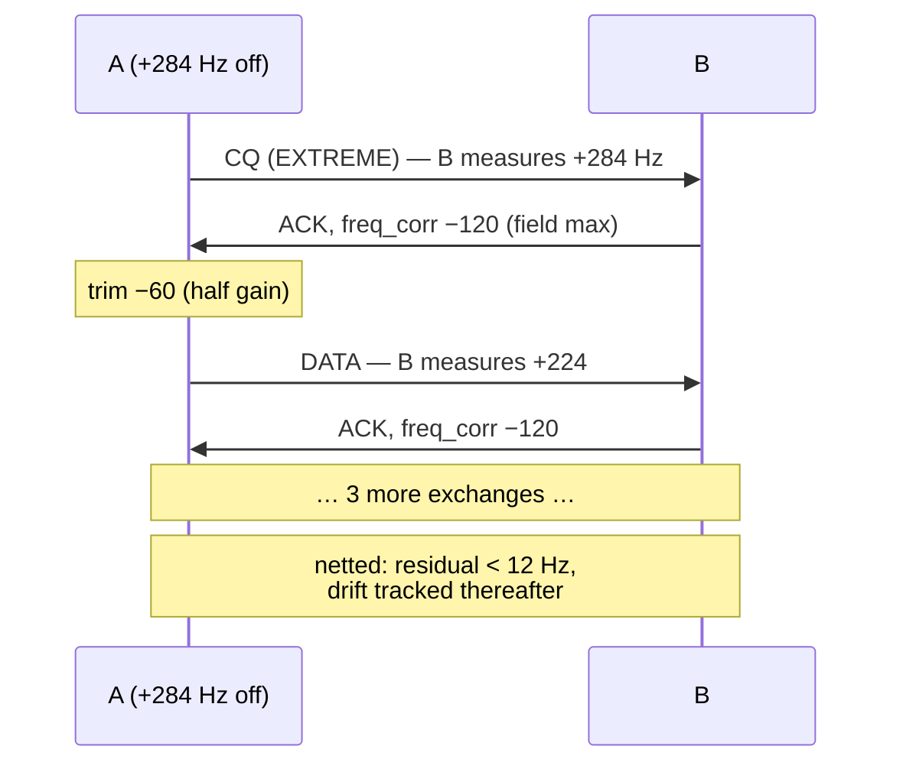

# Link layer

Two half-duplex stations form **two directed links**, each governed by its
*receiver* — only the receiver knows its own noise floor. There is no shared
"link mode" to negotiate; each side requests what it can hear.

## The rate ladder

13 operating points spanning **7.8 → 1059 bit/s** over **−17.9 → +4.7 dB**
(sensitivities measured with the recalibrated receiver; dominated rungs
removed). Requests and grants are ladder indices in the LC word.

| # | mode / mod / FEC | bit/s | sens dB | # | mode / mod / FEC | bit/s | sens dB |
|---|---|---|---|---|---|---|---|
| 0 | EXTREME BPSK ⅓ | 7.8 | −17.9 | 7 | NORMAL QPSK ½ | 353 | −5.3 |
| 1 | ROBUST BPSK ⅓ | 31 | −11.7 | 8 | NORMAL QPSK ⅔ | 471 | −3.8 |
| 2 | ROBUST BPSK ½ | 46 | −11.8 | 9 | NORMAL QPSK ¾ | 529 | −2.2 |
| 3 | ROBUST QPSK ⅓ | 62 | −11.3 | 10 | NORMAL QAM16 ½ | 706 | +0.7 |
| 4 | NORMAL BPSK ⅓ | 118 | −7.6 | 11 | NORMAL QAM16 ⅔ | 941 | +2.6 |
| 5 | NORMAL BPSK ½ | 176 | −7.3 | 12 | NORMAL QAM16 ¾ | 1059 | +4.7 |
| 6 | NORMAL QPSK ⅓ | 235 | −7.0 | | | | |

## The link-control word (20 bits, in `Data.reserved`)

Flags: bit0 = last fragment, bit1 = no-data (ack-only), bit2 = priority
stream. Every frame piggybacks the full word — data, ACKs, everything.

## Adaptation: three feedback paths, three latencies

Bootstrap: both sides start at rung 0 (EXTREME) — it works whenever anything
works — and one decoded exchange is enough measurement to jump to the
SNR-indicated rung (fast start).

## ARQ and HARQ

Stop-and-wait with piggybacked ACKs (2-bit seq is sufficient). On CRC
failure the PHY exports the data-block LLRs; a retransmission is first tried
alone, then **chase-combined** (LLR sum) with the stored attempt — blind,
because the seq lives inside the undecodable payload, and safe, because the
CRC arbitrates. Worth ~3 dB on a same-rung retransmission in the
noise-limited regime.

## QoS

Three classes as *policy*, not machinery: strict priority
control > interactive > bulk; per-class air-time caps size fragments
(latency budgeting — a 27-byte EXTREME frame is 43 s); control/ACK traffic
rides one rung below bulk (extra margin). The priority stream **preempts**
an in-progress bulk message at fragment boundaries (LC flag bit2 selects one
of two reassembly buffers) — no head-of-line blocking behind a long
transfer.

## Simplex channel access

Key rules: carrier sense before keying; the listen window is sized from the
*expected reply's* air time; **a timeout on a busy channel is not a loss**;
random backoff breaks the symmetry of two stations keying together; a
station replies only to frames that carried data — no ack-of-ack loops.

## AFC frequency netting

The receiver measures the peer's carrier offset on every frame and requests
a correction in the LC word (±120 Hz/frame, 8 Hz steps, ±12 Hz deadband).
The peer trims its shared reference at **half gain** — both sides act on
stale measurements, and full-gain corrections would swap offsets each turn.

Guard rails (the loop only sees the *differential* offset, so the common
frequency would otherwise random-walk): `afc_max_trim_hz` (±150 Hz default)
hard-clamps each station's cumulative trim — un-correctable residue is left
to the modem's ±300 Hz tolerance; `afc_anchor=True` designates a station
that never trims, pinning the absolute frequency.
