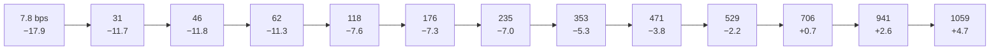

# Measured performance

All figures: article channel model (multipath `[1,0,0.4,0,0,0.2]`, BSC 10⁻³,
BEC 2·10⁻², random ±100 Hz CFO + drift, random timing), PER ≤ 10% criterion,
SNR referenced to the 6 kHz audio band unless stated.

## Article reproduction

| Metric | Article | This implementation |
|---|---|---|
| Worked examples (CRC, Base38, conv outputs, scrambler…) | — | 44/44 bit-exact |
| Sensitivity, BPSK ⅓ | ≈ −7.5 dB | −7.2 dB (raw RX); genie-sync −7.6 |
| OTA log (Es/N0, SNR, BER ranges) | 14 km real test | reproduced in simulation |

The residual reproduction gap was diagnosed as synchronization (the ZC ±1-bin
scan bug, fixed) — the decode chain itself matches the article.

## The ladder (recalibrated receiver)

Sensitivity in dB at PER ≤ 10%, user rate in bit/s:

EXTREME runs at 78% of Shannon capacity at −20 dB (theoretical wall −20.7 dB).

## Feature gains (A/B measured)

| Feature | Measured effect |
|---|---|
| LLR recalibration (monotone reliability map) | +1.5–2 dB on BPSK/QPSK rungs (−9 dB: 6/40 → 29/40); regresses 16-QAM → gated MU≤2 |
| HARQ chase combining | 2nd attempt 15/20 vs 10/20 at −8.5 dB (noise-limited regime; fade losses are sync-level) |
| LDPC (IRA 768/256) vs conv | +0.7 dB AWGN at BLER 10%; ≈ parity end-to-end (front-end LLR quality binds, not the code) |
| STF preamble variant | equal to Newman everywhere (±0.14 dB over 8 configs, 2σ agreement per point) |
| AFC netting | +284 Hz → <12 Hz in 5 exchanges; steady ≤6.5 Hz under 0.09 Hz/s relative drift |
| Fixed-point RX vs float | ≤0.5 dB loss at −7; **ahead** at −9/−10 (22 vs 20, 11 vs 5 of 30 against float+recal); QAM16 within 0.3–0.8 dB after per-modulation LLR quantization (8-bit for MU=4; the 6-bit path cost ~2 dB at rates 2/3–3/4) |
| Integer SNR estimator (fixed RX) | ≤1.5 dB error, −17…+8 dB, all modes/modulations; gain-weighted pooling required — equal-weight was 5–15 dB pessimistic on faded EXTREME frames and stalled the ladder |
| Gated two-stage frequency search | ~5.5× fewer derotated samples above the 2.25× contrast gate; PER identical to the exhaustive grid at every waterfall point, float and fixed; the ungated coarse-only ablation loses 0.5–1 dB at the EXTREME edge (`coarse_search_ab.png`) |

## Robustness data points

- Tiled chain survives ≤65% contiguous audio erasure (4× tiles keep partial
  symbols alive).
- Detection: 0/20 false alarms on pure noise, all modes.
- CFO: physically-derived offsets to +284 Hz handled; measured-vs-predicted
  agreement 0.1 Hz through the RF chain.

## System-level demos (in `results/`)

| Artifact | Shows |
|---|---|
| `system_demo.wav` + `system_demo_timeline.png` | full QSO over the RF chain: EXTREME negotiation → speed climb → AFC netting → bidirectional transfer, blind-decoded transcript with per-station CFO fingerprints |
| `system_demo_fixed.wav` (−2/−1 dB) · `system_demo_fixed_qam16.wav` (+5 dB) + timelines | the same QSO with stations **and** monitor on the full fixed-point pipeline (`demo_wav.py --phy fixed`): 37/47 and 26/40 frames blind-decoded; the +5 dB session climbs into QAM16 (rungs 9–10) |
| `per_adaptive_modes.png` | the three modes' PER waterfalls |
| `ber_vs_snr.png`, `per_vs_snr.png` (+`_stf`) | article Fig. 23/24 reproduction, both preambles |
| `link_adaptation.png` | controller-level two-station adaptation over a fading timeline |
| `ladder_recal.json` | full PER curves behind every ladder sensitivity |

## Link budget context (EXTREME, −17.5 dB operating point)

S/N₀ ≈ +20.3 dB-Hz ≈ −13.7 dB in the ham 2.5 kHz convention (≈7 dB shy of
FT8). On 80 m at 10 W: 500–2000 km nightly, 3000–5000 km from quiet rural
sites; on 40 m at 10 W: 300–1500 km all day, worldwide multi-hop on winter
nights from quiet sites; 100 W adds one ionospheric hop to everything.
Details in the README's link-budget section.
