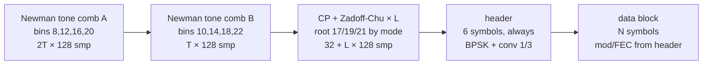
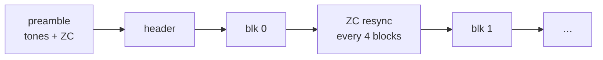
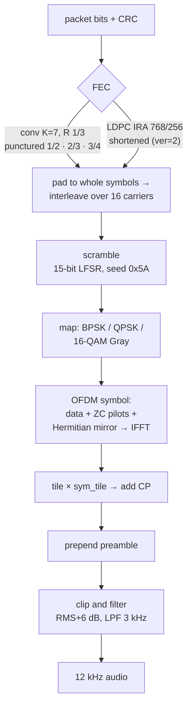
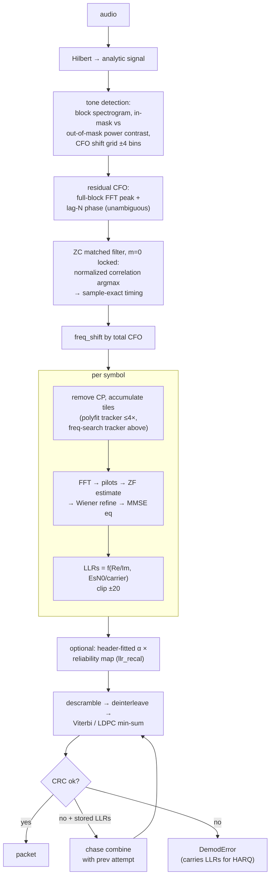
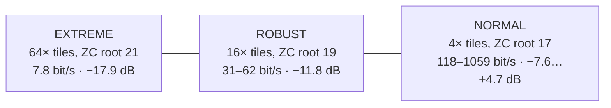

# PHY layer

## Numerology

| Parameter | Value |
|---|---|
| Sample rate | 12 kHz (audio into an SSB transceiver, AGC off) |
| FFT | 128 bins → 93.75 Hz spacing |
| Band | 300–2400 Hz → bins 3..25, 23 subcarriers |
| Pilots | 7, Zadoff-Chu root 3, bins 3 6 10 14 17 21 25 |
| Data carriers | 16 |
| Cyclic prefix | 32 samples (25%) |
| Symbol tiling | 4× / 16× / 64× by link mode (+6 dB per 4×, coherent) |
| CFO tolerance | ±375 Hz design, ±300 Hz spec |

## Frame structure



Header (25 bits): `ver(2) | typ(3) | mod(2) | spd(2) | len(8) | CRC-8`.
`ver=2` marks an LDPC-coded data block; `len` is the data-packet bit count
(≤255). Preamble tone and ZC bins carry gain (×√5.75 and ×2) so the whole
frame has uniform per-sample power — detection sensitivity depends on it.

## Streaming bursts

`Transceiver.build_stream` / `demod_stream` pay the fixed cost once for a
whole burst instead of once per packet:



Every block shares the packet type, size, modulation and code rate — that is
what lets one header describe all of them. Measured fixed cost per frame:

| | tones | ZC | header | fixed total |
|---|---|---|---|---|
| NORMAL | 0.320 s | 0.045 s | 0.272 s | 0.637 s |
| ROBUST | 1.280 s | 0.173 s | 1.040 s | 2.49 s |
| EXTREME | 5.120 s | 0.685 s | 4.112 s | 9.92 s |

For 20 × 27-byte NORMAL packets that is **1.73× the throughput for 0.08 dB**
of sensitivity (`experiments/stream_mode.py`, 6000 blocks per SNR point).
The cost is carrying one preamble-derived CFO estimate across the burst
instead of re-estimating per frame; it grows with burst length, measuring
≈0.35 dB for a 5-block EXTREME burst (on 200 blocks/point, so a wider error
bar), where 1.21× is a poor trade for dB that expensive.

Three things worth knowing:

- **The ZC resync is not what holds the stream together.** An open-loop
  24 s stream (`--resync 0`) decodes at the same PER: the per-symbol
  frequency search and the pilot channel estimate do all the tracking. The
  ZC is there for sample-clock offset (a 32-sample CP slips in ~133 s at
  20 ppm — irrelevant for a 13 s NORMAL burst, mandatory for EXTREME) and so
  a receiver that missed the opening preamble can re-enter mid-burst.
- **Resync uses `max_cfo=0`**, like the composite detector and for the same
  reason: a stream already knows its CFO, and widening the ZC scan
  re-introduces the time-frequency ambiguity (~1 dB). A lock outside the
  plausibility window is discarded so a spurious correlation cannot walk the
  stream off its grid.
- **Failures do not cascade.** Block offsets are deterministic, so a block
  that fails CRC costs exactly that block; its raw LLRs are kept in
  `BlockStats.llrs` for chase combining on the retransmission.

The block *count* is not in the waveform — the link layer signals it, or
`demod_stream(n_blocks=None)` decodes until the samples run out. Rate is
frozen for the burst (no per-block header), which is the real price on a
fading channel and the reason to keep bursts bounded.

All three layers carry it: float (`Transceiver.build_stream` /
`demod_stream`), fixed (`FixedTransmitter.build_stream` /
`FixedReceiver.receive_stream`) and C (`tx_build_burst` /
`rxd_receive_burst`, bit-exact against the fixed model via the `TX_BURST_*`
golden vectors). Conv FEC only. One invariant that bites: the clip
threshold is a **whole-waveform** RMS, so a burst is not the concatenation
of separately built frames — a 1-block burst with no resync is bit-identical
to a frame, which both suites assert.

## Broadcast (non-ARQ)

`ofdm_phy/broadcast.py`. Speech and telemetry cannot wait for a
retransmission, so broadcast is streaming with the acknowledgment
machinery subtracted — no ack request, no window, no selective repeat,
no reply timer — plus the one thing a burst does not need: a way for a
listener who was not there at the start to join.

```
[preamble][header][f0 SYNC][f1][f2][f3]   <- one group
[preamble][header][f0 SYNC][f1][f2][f3]   <- the next
```

Every group re-sends the preamble and a SYNC frame carrying the payload
descriptor, so a receiver acquires at the next group boundary instead of
waiting for the broadcast to end. Framing is **two bytes**:

| field | bits | why |
|---|---|---|
| SYNC | 1 | opens a group; descriptor follows |
| EOS | 1 | last frame of the broadcast |
| seq | 6 | loss statistics only — never retransmission |
| length | 8 | valid payload bytes in *this* frame |

Deliberately not RTP, whose 12-byte header would be 91 ms of air time at
the top rung. No timestamp (delay here is deterministic, so a frame's
position in the stream *is* its timestamp), no SSRC, no per-packet
payload type. The per-frame length costs ~4% and buys a property that
matters when nothing is repeated: every frame is self-delimiting, so
losing the EOS frame does not mis-size the payload.

Measured (`experiments/broadcast_demo.py`, 200 B, group 4):

| | 100% delivered | 90%+ | falls apart |
|---|---|---|---|
| speech, rung 12 (QAM16 3/4) | +9.5 dB | +5 dB | +2 dB |
| telemetry, rung 7 (QPSK 1/2) | +1.5 dB | −3 dB | −6 dB |

A receiver tuning in half-way through the first group of seven recovers
**90% of the remainder** — it cannot get back what it never heard.

Two things worth knowing before touching this:

- **The detector needs a slice bounded on BOTH sides**, holding exactly
  one preamble. `detect_preamble` takes a global argmax, so given
  several groups it locks the strongest, not the first, and every group
  before it is silently lost — 300 samples of lead-in was enough to skip
  one. Starting the slice on a preamble is not sufficient; searching
  forward for the next preamble to find the far edge does not work
  either, because from inside a group the detector false-locks on data.
  The bound is geometry: `preamble + header + blocks`. The first decode
  necessarily runs unbounded, so the receiver learns the extent from it
  and then **restarts the walk** with the bound in place.
- **LLR recalibration is on by default** and matters more here than in
  ARQ, because an unrecoverable frame is simply gone: telemetry at
  −4.5 dB went from 30.6% to 69.8% of payload recovered. Gated to
  MU≤2, so 16-QAM speech is untouched.

Broadcast runs on all three chains (`chain="float"` / `"fixed"`, and
`cport/src/broadcast.c`). Building it exposed a defect in the integer
detector worth ~8% of *all* acquisitions — a lag-N residual that wraps
at exactly one coarse bin — which ARQ had been hiding by
retransmitting; see the technical report §10.7. After the fix the
integer chain matches float on delivery and is ahead at the lowest
SNRs.

### On the boards

The firmware is a fourth path, and it had to be: `bc_receive` scans a
whole recording and a board never holds one. `cport/usb/usb_radio_main.c`
builds **one group per keying** and walks the received group with
`bc_advance()` over the *streaming* receiver — the same
`rxs_continue_burst()` stepping burst ARQ uses, with the acknowledgment
machinery absent rather than subtracted. The host drives it over the USB
modem protocol: `UP_CMD_BCAST` (payload type, rung, ≤1022 B) out;
`UP_EVT_BCAST` back, streaming the payload *as it decodes* — a start
marker carrying the payload type, then data chunks, then an EOS frame
with `frames_ok`, `frames_lost` and the mean SNR. In the console that is
`bcast [-r <rung>] <text>`.

Three things the firmware has to get right that no host model faced:

- **BCAST frames are Data-shaped but carry no link-control word**, so
  the broadcast walk runs *before* the station's reassembler — one
  reaching it would be read as an ARQ fragment.
- **A walk in progress holds the transmitter and pins its mode active**
  (a muted receiver instance stops detecting, and the walk is not
  running the detector anyway), which means it needs a deadline. Without
  one, a peer that stops mid-group leaves the board mute for good: the
  walk only advances on events, and a peer that stopped sends none.
- **One group is one keying**, so its air time is bound like everything
  else the station emits. The group halves — `log2(group)` is what goes
  on the wire in the SYNC descriptor — until it fits 30 s: four 26-byte
  frames are 9.2 s at rung 4, and at EXTREME a single frame is already
  42 s.

The rung is not negotiated, because there is no peer to negotiate with.
An explicit `-r` is honoured as given: EXTREME is the only mode an idle
station is guaranteed to still be listening on, so a beacon meant for
strangers belongs there. Measured on the two-board stand, a `-r 0`
broadcast to a board that had never exchanged a frame with the sender
(listening EXTREME only) arrived byte-exact at +16.2 dB — 2 groups of
one 42-s frame each. At rung 4 (122-byte payload, four-frame groups):
**24 of 24 groups** across a 12-broadcast run, 38 of 39 across every
run of the campaign. The one loss went **whole** — a missed acquisition
takes the frames behind it with it, which is the shape of every non-ARQ
loss and the reason the EOS event reports what arrived. The host twin
of the same build-and-walk path is `make bcrepro` (part of
`make robust`).

## Transmit chain



## Receive chain



### Synchronization details worth knowing

- **Tone metric** is a contrast ratio (mean in-mask bin power / mean
  out-of-mask), floor-regularized by 1% of the median block power — an
  absolute energy fraction is SNR-dependent and noise-free signals divide by
  zero.
- **ZC stage is locked to the zero-CFO hypothesis.** Scanning m=±1 lets the
  ZC time-frequency ambiguity (a frequency-shifted replica correlates at a
  shifted time) win at low SNR: ±1 bin CFO error + ~30-sample timing error,
  ≈1 dB of sensitivity. Low-SNR modes use a group-coherent kernel with a
  small ±15 Hz fractional grid instead.
- **The `STFOFDMModem` variant** places tones every 8 bins (period-16 comb),
  replacing the FFT-peak residual estimator with 802.11-style
  delay-and-correlate (lag-16 → lag-128), equal performance over ±300 Hz.

## Link modes



Long-symbol modes replace per-tile phase tracking (pure noise at −19 dB) with
a **per-symbol residual-CFO hypothesis search**: derotate the whole symbol
over a frequency grid, accumulate tiles, keep the hypothesis with maximum
in-band energy — spending the symbol's full energy (~19 dB E/N0 even at
−20 dB SNR) on the frequency decision. A slew-limited tracker (full grid on
the first symbol, ±2 steps after) suppresses per-symbol argmax noise.

EXTREME sits at 78% of Shannon capacity at −20 dB (22.3 vs 30 bit/s in
2100 Hz), so its −17.9 dB measured floor is ~3 dB from the theoretical wall.

## LLR quality and recalibration

The raw LLRs (`4·re·EsN0`, clipped ±20) are *shape*-miscalibrated: weak LLRs
are ~4× more reliable than they claim (decision-directed noise estimation +
per-carrier weighting), the clipped top overstates. A measured monotone
reliability map (each |L| bin → log-odds of its empirical error rate) fixes
it and is worth **1.5–2 dB** at the BPSK/QPSK sensitivity edge. Gated to
MU≤2 (trained on BPSK statistics); off by default, on in the link layer.
