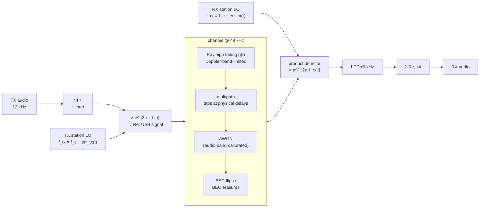
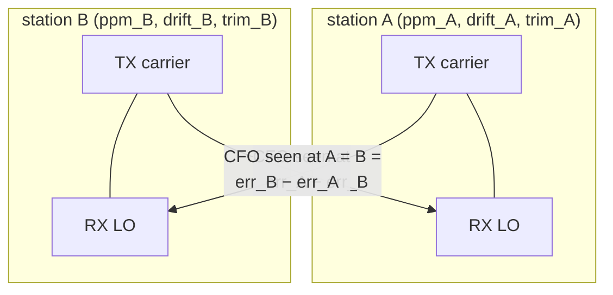
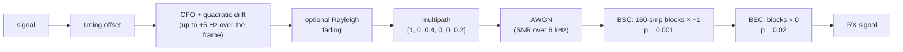

# RF layer and channel models

Two channel models exist. The audio-domain simulator (`channel.py`) is the
article's model and drives most sweeps; the RF layer (`rf.py`) models the
actual transceiver chain so carrier offsets **emerge from physics** instead
of being injected as parameters.

## The RF chain

Simulation runs at a 48 kHz IF rate with a 12 kHz carrier standing in for
the RF carrier; LO errors are specified in ppm of the *nominal RF frequency*
(e.g., 7.1 MHz), so audio-band offsets come out physically correct.



## The LO model — where CFO comes from

Each `StationRF` has **one reference oscillator shared by its TX and RX**
(as in a real transceiver):

```
err(t) = f_rf · ppm · 1e-6  +  drift_hz_per_s · t  +  trim_hz
```

The audio CFO between two stations is `err_tx(t) − err_rx(t)`. Validated to
0.1 Hz at +99.4 / −106.5 / +284.0 Hz scenarios (worn-TCXO rigs on 7–14 MHz).
`trim_hz` is the AFC netting hook — moving it shifts TX and RX together,
which is exactly why the protocol asks the *peer* to correct rather than
retuning locally (see [link.md](link.md)).



## Calibration subtleties (documented traps)

- **AWGN sizing**: the product detector's `Re()` halves *uncorrelated noise*
  power but not the coherent signal, so the RF noise variance factor is
  `2·P_sig·10^(−SNR/10)` — not the naive bandwidth ratio. Getting this wrong
  silently costs 3 dB. With the correct factor, the audio-band SNR
  convention matches the audio-domain simulator, so all measured
  sensitivities carry over.
- **Rayleigh fading** (`rayleigh_fading`): complex Gaussian band-limited to
  the Doppler bandwidth (0.1–0.5 Hz typical HF QSB), unit mean power,
  applied to the analytic signal. AWGN is sized from the *average* faded
  power, so instantaneous SNR swings around the nominal value.
- **Multipath at RF**: the audio-domain tap delays are physical, so taps map
  to UP-spaced positions at the RF rate.

## The audio-domain simulator (article model)

`simulate_channel(signal, time_shift, freq_shift_hz, fs, ...)`:



SNR convention everywhere: signal power vs noise power in the **6 kHz audio
Nyquist band** (subtract ~4.5 dB to compare with in-signal-band figures;
subtract ~3.8 dB for the ham 2.5 kHz convention).
